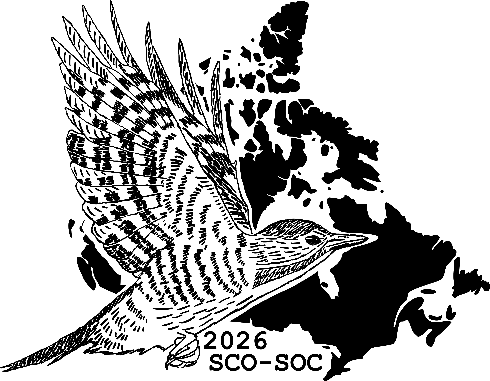
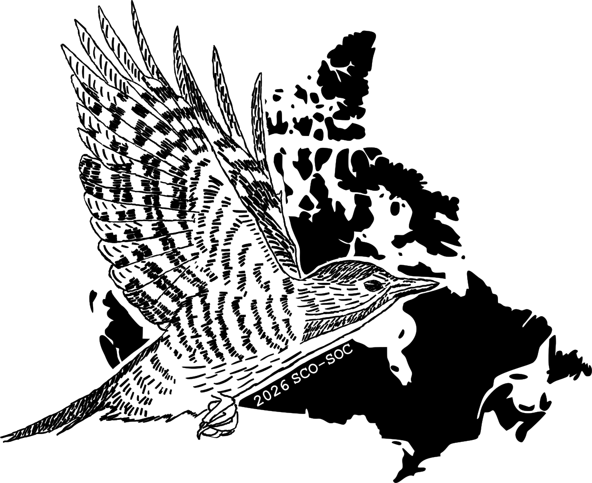
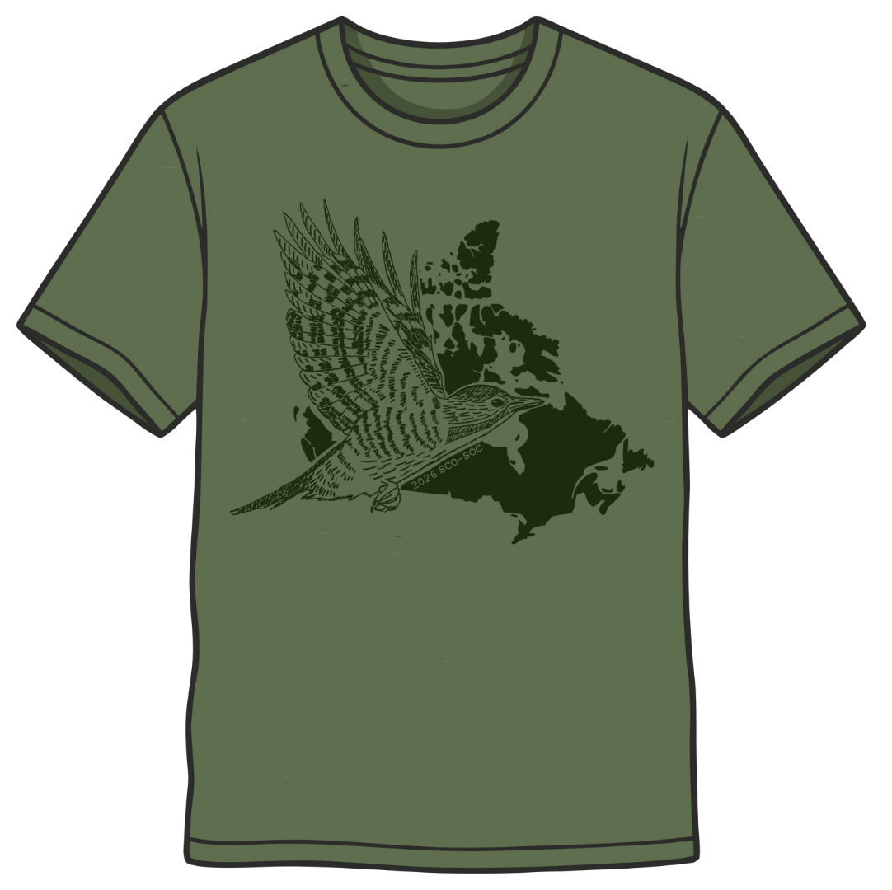
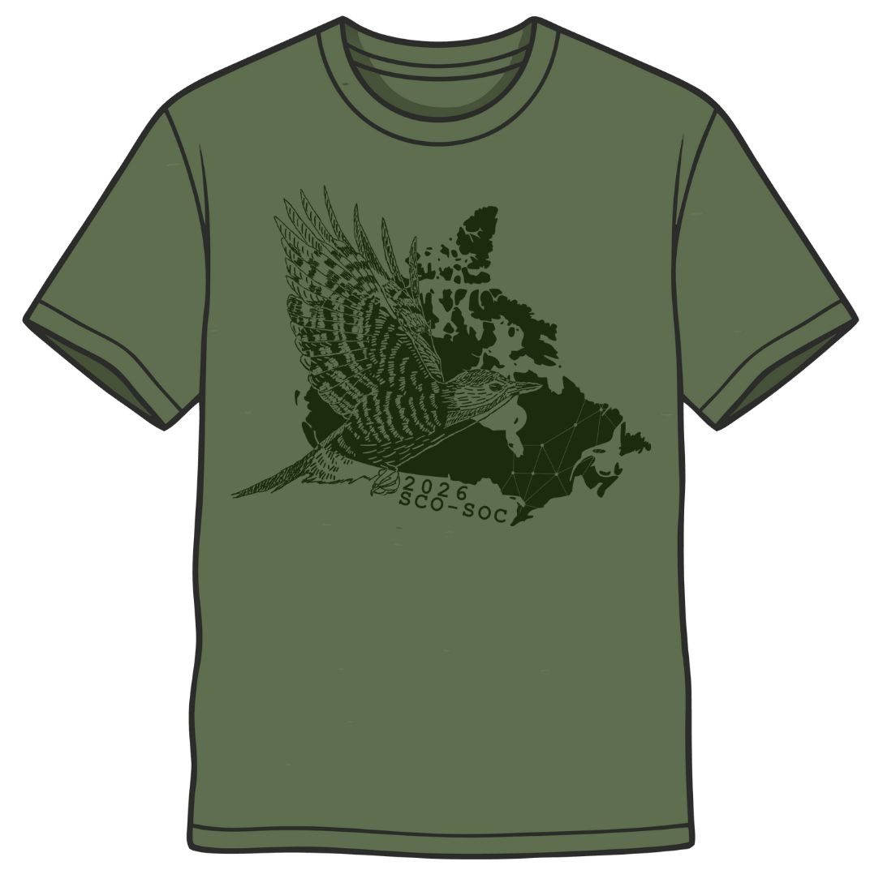

# Logo design for 2026 SCO-SOC conference

Visual design for the SCO-SOC conference. The logo will be used on websites, and potentially T-shirts. 

## Requested component
- A round logo
- Include the Black-backed Woodpecker
- Conference theme is "Spread Our Wings"
- Virtual conference

## Product

#### version 3 (2026 Feb.12)

Download: [PNG](./docs/product/logo_v3.png) (raster), [SVG](./docs/product/logo_v3.svg) (vector)

#### version 2 (2026 Feb.07)
Logo         |  T-shirt mockup
:-------------------------:|:-------------------------:
 |  

#### version 1 (2026 Feb.07)

Logo         |  T-shirt mockup
:-------------------------:|:-------------------------:
 |  

## Schedule
- Confirm the role as a logo designer: Jan.15
- Email discussion with design requirements: Jan.21
- Draft design for Mat, Steffi, and Ann: Feb.10
- Final version and newspaper release: Feb.15

